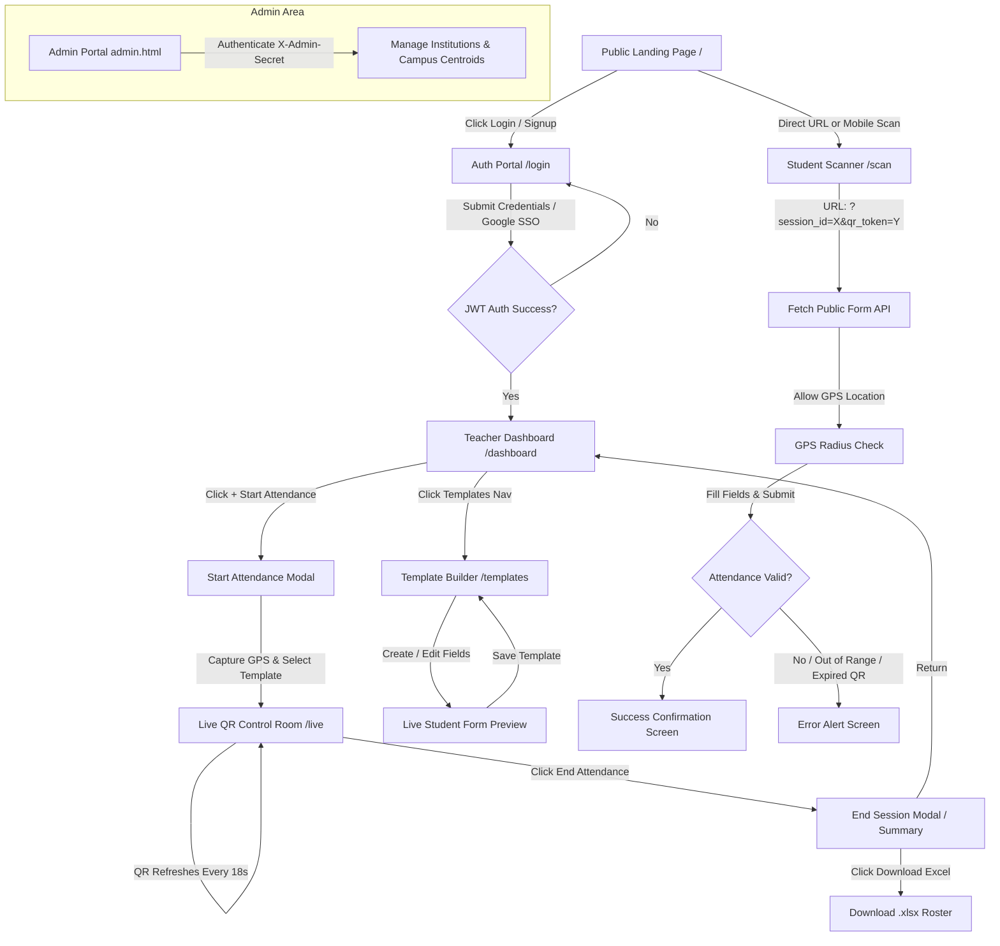
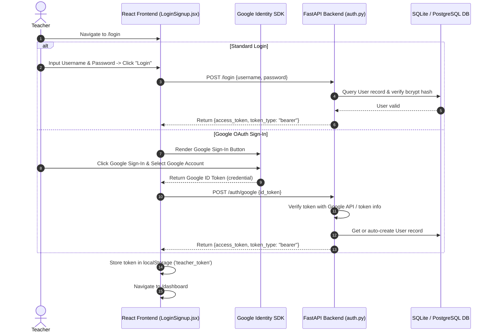
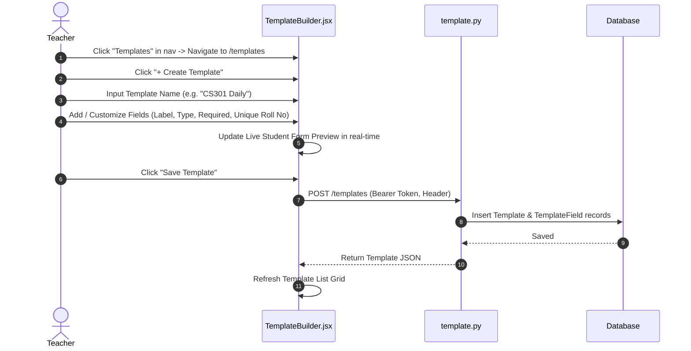
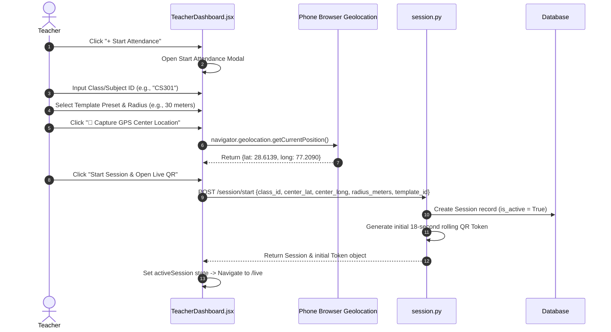
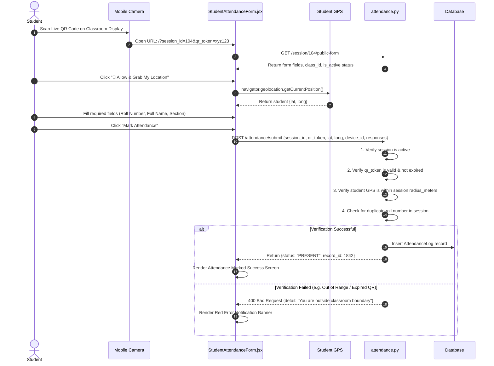
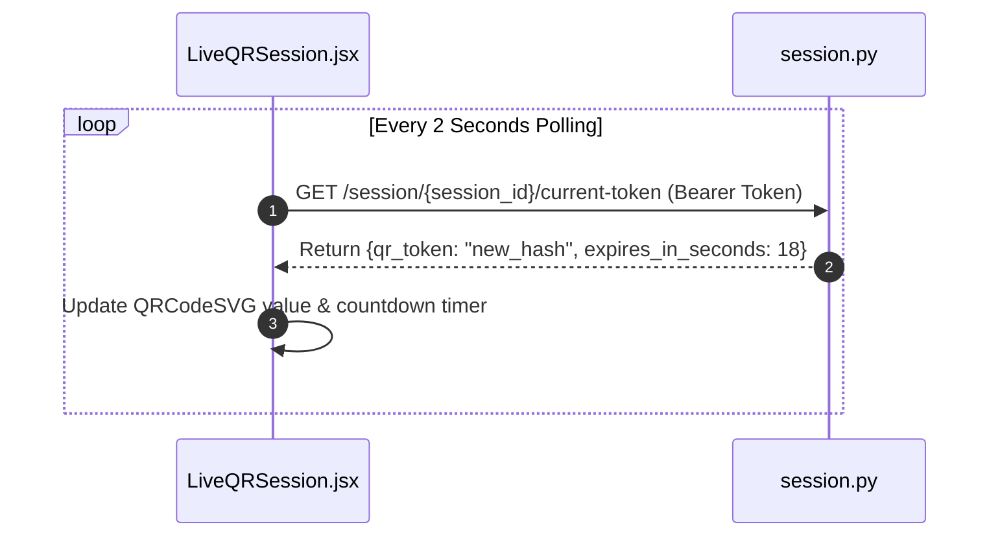
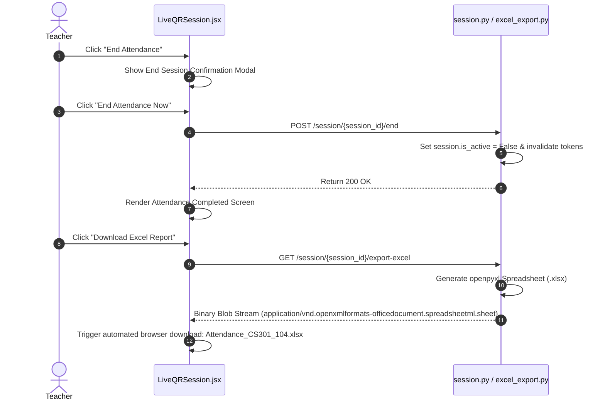

# RollQR — Professional UX Wireframe & User-Flow Specification

> **Repository:** `Arjunpurwar2005/qr-code-generator`  
> **Branch:** `feature/flow`  
> **Target Audience:** Engineering Team, Product Managers, UI/UX Designers, College Administration  
> **Version:** 2.0.0 (Production-Ready Architecture)  

---

## Executive Summary & System Overview

**RollQR** is a high-security, location-verified classroom attendance platform built for higher education institutions (such as KCC Institute of Technology & Management - KCCITM). The system eliminates manual roll calls and proxy attendance by combining **rotating dynamic QR tokens** (refreshing every 18-20 seconds) with **GPS geofence radius verification** and **device-based hardware binding**.

### Key System Architecture Capabilities:
1. **Teacher Control Center:** Start/end live attendance sessions, select custom attendance form presets, capture real-time instructor GPS coordinates, monitor live scan stats, and export attendance rosters instantly to Excel (`.xlsx`).
2. **Student Attendance Interface:** Zero-app, browser-native mobile workflow. Students scan the live dynamic classroom QR code, allow GPS location capture, fill required template fields (Roll Number, Full Name, Section), and submit attendance.
3. **Dynamic Form Builder & Templates:** Teachers create reusable form presets with custom validation rules (Text, Number, Dropdown, Unique Roll Number identifiers).
4. **Institutional Security Layer:** Institution Admin Portal (`admin.html`) configures campus geographic centroids and geofence radii mapped to official college email domains (`@kccitm.edu.in`).

---

## 1. Information Architecture & Sitemap

### 1.1 Structural Area Classification

| Area | Accessibility | Key Components & Purpose |
| :--- | :--- | :--- |
| **Public Portal** | Anyone | Landing Page (`/` - Marketing, Features, How-it-Works, FAQ) |
| **Authentication** | Unauthenticated Teachers | Login / Signup (`/login` - Username/Password & Google OAuth 2.0) |
| **Faculty Portal** | Authenticated Teachers (JWT) | Dashboard (`/dashboard`), Live QR (`/live`), Templates (`/templates`) |
| **Student Scanner** | Anyone with Scan Link | Attendance Form (`/scan` or `/?session_id=X&qr_token=Y`) |
| **Admin Portal** | System Administrators | Institution Geofence Management (`/admin.html` with `X-Admin-Secret`) |

---

### 1.2 Sitemap Diagram (Visual Flow)



---

### 1.3 Access Control & Route Protection Matrix

| Route Path | Component / File | Access Requirement | Redirect on Unauthorized |
| :--- | :--- | :--- | :--- |
| `/` | `HomePage.jsx` | Public | None |
| `/login` | `LoginSignup.jsx` | Unauthenticated | Redirects to `/dashboard` if token present |
| `/dashboard` | `TeacherDashboard.jsx` | Teacher JWT Token | Redirects to `/login` |
| `/live` | `LiveQRSession.jsx` | Teacher JWT + Active Session | Redirects to `/login` |
| `/templates` | `TemplateBuilder.jsx` | Teacher JWT Token | Redirects to `/login` |
| `/scan` | `StudentAttendanceForm.jsx` | Public (`session_id` query param) | Shows "Form Not Found" if invalid |
| `/admin.html` | `admin.html` | `X-Admin-Secret` Header | Displays Connection Setup Card |

---

## 2. Professional Low-to-Mid Fidelity Wireframes

### Screen 1: Landing Page (`/` — `HomePage.jsx`)

#### Desktop View Layout
```
+-----------------------------------------------------------------------------------+
| [RQ] RollQR    Home   How it Works v   Features v   For Teachers   For Students   | [ Login ] [ Start Attendance -> ] |
+-----------------------------------------------------------------------------------+
|                                                                                   |
|  Eliminate Proxy Attendance.                 +-----------------------------------+  |
|  Instant Classroom QR Roll Call.            | LIVE ATTENDANCE - KCCITM           |  |
|                                             | CSE — 3rd Year         [ 42 Present]|  |
|  Take attendance in 10 seconds with dynamic | +-------------------------------+ |  |
|  rotating QR codes & GPS verification.      | | [#####  QR CODE RETICLE #####] | |  |
|                                             | | [#####  SCAN TO MARK    #####] | |  |
|  [ Start Attendance -> ] [ See Demo Video ] | +-------------------------------+ |  |
|                                             | Progress: 42/62 [==============  ] |  |
|  * Location Verified  * Zero App Download   +-----------------------------------+  |
|                                                                                   |
+-----------------------------------------------------------------------------------+
|  BUILT FOR CLASSROOMS AT: [KCCITM]  ·  KCC Institute of Technology & Management   |
+-----------------------------------------------------------------------------------+
|  FEATURES AT A GLANCE                                                             |
|  +--------------------+  +--------------------+  +-----------------------------+  |
|  | (QR) Dynamic QR    |  | (GPS) Geofencing   |  | (Excel) One-Click Export    |  |
|  | Refreshes constantly|  | Classroom radius   |  | Clean .xlsx reports ready   |  |
|  +--------------------+  +--------------------+  +-----------------------------+  |
+-----------------------------------------------------------------------------------+
```

#### Mobile Layout (`HomePage.jsx`)
```
+-----------------------------+
| [RQ] RollQR             [=] |
+-----------------------------+
| Live Classroom Attendance   |
|                             |
| Take attendance in seconds. |
| No app download required.   |
|                             |
| [ Start Attendance -> ]     |
| [ Login ]                   |
|                             |
| +-------------------------+ |
| | LIVE SESSION: KCCITM    | |
| | 42 Students Present     | |
| | [ QR CODE PREVIEW ]     | |
| +-------------------------+ |
+-----------------------------+
```

---

### Screen 2: Teacher Auth Portal (`/login` — `LoginSignup.jsx`)

#### Desktop Split View
```
+------------------------------------------+----------------------------------------+
| [RQ] RollQR                              | Teacher Login                          |
|                                          | Welcome back. Enter your credentials.  |
| Welcome back.                            |                                        |
| Your attendance dashboard is a scan away.| [ G  Sign in with Google             ] |
|                                          | ----------------- OR ----------------- |
| +--------------------------------------+ |                                        |
| | LIVE SESSION: KCCITM CSE 3rd Year   | | USERNAME *                             |
| | 42 Present                            | | [ prof_sharma                      ] |
| | [ QR Code Visual ]                   | |                                        |
| +--------------------------------------+ | PASSWORD *                             |
|                                          | [ **********                   (o) ] |
| * Generate QR in 1 click                 |                                        |
| * GPS-verified attendance                | [ Login ->                           ] |
| * Instant Excel download                 |                                        |
|                                          | Don't have an account? [Create account]|
+------------------------------------------+----------------------------------------+
```

---

### Screen 3: Teacher Command Dashboard (`/dashboard` — `TeacherDashboard.jsx`)

#### Dashboard Layout with Active Session & History
```
+-----------------------------------------------------------------------------------+
| [RQ] RollQR    Dashboard   Sessions (Live)   Templates          [ Prof. Sharma (S)]|
+-----------------------------------------------------------------------------------+
|                                                                                   |
|  FACULTY OPERATIONAL COMMAND                                                      |
|  Good morning, Prof. Sharma 👋                                                    |
|  Manage classroom attendance in seconds. Select a template or start an instant QR. |
|                                                    [ + Start Attendance ]         |
+-----------------------------------------------------------------------------------+
|  ACTIVE ATTENDANCE SESSION                                                        |
|  +------------------------------------------------------------------------------+  |
|  | (• LIVE ATTENDANCE)  Session #104                                            |  |
|  | CS301 Data Structures & Algorithms                                           |  |
|  | Geofence Radius: 30m  •  Preset: CSE Standard Roster                          |  |
|  |                                      [ End Attendance ]  [ Open Live QR -> ] |  |
|  +------------------------------------------------------------------------------+  |
+-----------------------------------------------------------------------------------+
|  QUICK ACTIONS                                                                    |
|  +-----------------------+  +-----------------------+  +-----------------------+  |
|  | (Play)                |  | (Plus)                |  | (History)             |  |
|  | Start Attendance      |  | Create Template       |  | View History          |  |
|  | Rolling QR + Geofence |  | Custom form presets   |  | Export past sessions  |  |
|  +-----------------------+  +-----------------------+  +-----------------------+  |
+-----------------------------------------------------------------------------------+
|  RECENT ATTENDANCE ACTIVITY                                   [ Search sessions ]  |
|  +------------------------------------------------------------------------------+  |
|  | (Table) CS301 Data Structures  •  Session #104  [LIVE]    [ Download Excel ] |  |
|  | (Table) CS302 Database System   •  Session #101  [ENDED]   [ Download Excel ] |  |
|  | (Table) CS305 Computer Networks •  Session #98   [ENDED]   [ Download Excel ] |  |
|  +------------------------------------------------------------------------------+  |
+-----------------------------------------------------------------------------------+
```

---

### Screen 4: Start Attendance Setup Modal

```
+-------------------------------------------------------------------------+
| (QR) Start Attendance                                              [X]  |
| Set up your class and generate a QR code.                               |
+-------------------------------------------------------------------------+
|                                                                         |
| CLASS / SUBJECT NAME *                                                  |
| [ CS301 Data Structures & Algorithms                                  ] |
|                                                                         |
| ATTENDANCE FORM PRESET                                                  |
| [ Standard Default Form (Roll Number, Student Name)                 v ] |
|                                                                         |
| GEOFENCE BOUNDARY RADIUS (METERS)                                       |
| [ 30 ]  Allowed student radius from instructor GPS center               |
|                                                                         |
| [ (📍) GPS Verified (28.6139, 77.2090)                                ] |
|                                                                         |
+-------------------------------------------------------------------------+
|                                  [ Cancel ]  [ Start Session & Open Live QR ]
+-------------------------------------------------------------------------+
```

---

### Screen 5: Live QR Control Room (`/live` — `LiveQRSession.jsx`)

#### Control Room Dark-Mode UI
```
+-----------------------------------------------------------------------------------+
| [RQ] RollQR   (• LIVE ATTENDANCE CONTROL)            [ Download Excel ] [ Dashboard ]|
+-----------------------------------------------------------------------------------+
|                                                                                   |
|                    (• ATTENDANCE LIVE)                                            |
|                    CS301 Data Structures & Algorithms                             |
|                    Students can scan the QR code below using their phone.          |
|                                                                                   |
|                 +---------------------------------------+                         |
|                 |  +---------------------------------+  |                         |
|                 |  |                                 |  |                         |
|                 |  |      [ DYNAMIC QR CODE ]        |  |                         |
|                 |  |    (Refreshes automatically)    |  |                         |
|                 |  |                                 |  |                         |
|                 |  +---------------------------------+  |                         |
|                 |  Scan to mark attendance              |                         |
|                 |  (~) QR refreshes in 14s              |                         |
|                 +---------------------------------------+                         |
|                                                                                   |
|  +----------------------+  +----------------------+  +-------------------------+  |
|  | 1. SCAN              |  | 2. VERIFY            |  | 3. RECORDED             |  |
|  | Student scans QR     |  | GPS & Token checked  |  | Added to class roster   |  |
|  +----------------------+  +----------------------+  +-------------------------+  |
|                                                                                   |
|                 [ End Attendance ]    [ Download Excel ]                          |
+-----------------------------------------------------------------------------------+
```

---

### Screen 6: End Session Confirmation Modal

```
+-------------------------------------------------------------------------+
| (!) End Attendance Session?                                             |
| Students will no longer be able to scan or submit.                      |
+-------------------------------------------------------------------------+
|                                                                         |
| Class: CS301 Data Structures & Algorithms                               |
| Status: Active Rolling QR                                               |
|                                                                         |
+-------------------------------------------------------------------------+
|                                          [ Cancel ]  [ End Attendance Now ]
+-------------------------------------------------------------------------+
```

---

### Screen 7: Attendance Completed State (`LiveQRSession.jsx`)

```
+-----------------------------------------------------------------------------------+
| [RQ] RollQR   (Session Ended)                        [ Download Excel ] [ Dashboard ]|
+-----------------------------------------------------------------------------------+
|                                                                                   |
|                         +-------------------------------+                         |
|                         |              [✓]              |                         |
|                         |     Attendance Completed      |                         |
|                         | Session ended. Tokens locked. |                         |
|                         |                               |                         |
|                         | ROSTER TOTAL                  |                         |
|                         | 48 Students Present           |                         |
|                         |                               |                         |
|                         | [ Download Excel Report ]     |                         |
|                         | [ Back to Dashboard ]         |                         |
|                         +-------------------------------+                         |
|                                                                                   |
+-----------------------------------------------------------------------------------+
```

---

### Screen 8: Template Builder (`/templates` — `TemplateBuilder.jsx`)

#### Builder View with Live Interactive Mobile Preview
```
+-----------------------------------------------------------------------------------+
| [RQ] RollQR    Dashboard   Sessions   Templates           [ <-- Back to Dashboard ]|
+-----------------------------------------------------------------------------------+
|                                                                                   |
| Attendance Templates                                      [ + Create Template ]   |
| Create reusable forms for your classes.                                           |
+-----------------------------------------------------------------------------------+
| CREATE TEMPLATE                                                                   |
| +-----------------------------------------------+ +-----------------------------+ |
| | TEMPLATE NAME *                               | | (• LIVE STUDENT PREVIEW)    | |
| | [ CS301 Daily Attendance                    ] | |                             | |
| |                                               | | +-------------------------+ | |
| | ATTENDANCE FIELDS               [ + Add Field ] | | | Mark Attendance         | | |
| | +-------------------------------------------+ | | | CS301 Daily Attendance  | | |
| | | Field #1                                  | | | |                           | | |
| | | [ Roll Number    ] [ Text               v ] | | | Roll Number *             | | |
| | | [x] Required  [x] Unique Roll Number      | | | | [ Enter Roll Number     ] | | |
| | +-------------------------------------------+ | | |                           | | |
| | | Field #2                      [ Remove ]  | | | Student Name *            | | |
| | | [ Student Name   ] [ Text               v ] | | | [ Enter Student Name    ] | | |
| | | [x] Required  [ ] Unique Roll Number      | | | |                           | | |
| | +-------------------------------------------+ | | | [ Mark Attendance ]     | | |
| |                                               | | +-------------------------+ | |
| | [ Cancel ]           [ Save Template ]        | | Interactive Student View    | |
| +-----------------------------------------------+ +-----------------------------+ |
+-----------------------------------------------------------------------------------+
| SAVED TEMPLATES                                                                   |
| +--------------------------+  +--------------------------+                        |
| | (Doc) CS301 Daily Preset |  | (Doc) AI/ML Lab Template |                        |
| | 2 fields configured      |  | 3 fields configured      |                        |
| | [Roll Number*] [Name*]   |  | [Roll Number*] [Batch]   |                        |
| | [ Use Template -> ]      |  | [ Use Template -> ]      |                        |
| +--------------------------+  +--------------------------+                        |
+-----------------------------------------------------------------------------------+
```

---

### Screen 9: Student Attendance Form (`/scan` — `StudentAttendanceForm.jsx`)

#### Mobile Scan Screen
```
+-----------------------------+
| [RQ] RollQR  [Student Scan] |
+-----------------------------+
| Mark Attendance             |
| CS301 Data Structures       |
| Enter your details.         |
+-----------------------------+
|                             |
| [📍 Allow & Grab My Location]|
|  GPS Verified (28.61, 77.20)|
|                             |
| STUDENT NAME *              |
| [ Aarav Sharma            ] |
|                             |
| ROLL NUMBER *               |
| [ 2024001                 ] |
|                             |
| SECTION                     |
| [ Section A               v ]
|                             |
| [ (✓) Mark Attendance     ] |
|                             |
+-----------------------------+
```

---

### Screen 10: Student Success Confirmation Screen

```
+-----------------------------+
|                             |
|            [ ✓ ]            |
|     Attendance Marked!      |
|  Recorded successfully.     |
|                             |
|  CONFIRMATION DETAILS       |
|  Status: PRESENT            |
|  Record ID: #1842           |
|                             |
| Powered by RollQR           |
+-----------------------------+
```

---

### Screen 11: Institution Admin Portal (`admin.html`)

```
+-----------------------------------------------------------------------------------+
| [RQ] RollQR                                                  [ Admin Portal ]     |
+-----------------------------------------------------------------------------------+
| Institution Management                                                            |
| Set college campus location & geofence boundary for secure attendance             |
|                                                                                   |
| +-------------------------------------------------------------------------------+ |
| | (Key) Admin API Credentials                                                   | |
| | Backend URL: [ https://your-backend.onrender.com                            ] | |
| | Secret Key:  [ ********************                                         ] | |
| | [ Link Connect to Backend ]                                                   | |
| +-------------------------------------------------------------------------------+ |
|                                                                                   |
| +-------------------------------------------------------------------------------+ |
| | (Location) Add / Update Institution                                           | |
| | Email Domain: [ kccitm.edu.in ]   College Name: [ KCC Institute of Tech     ] | |
| | Latitude:     [ 28.465000     ]   Longitude:    [ 77.502000                 ] | |
| | Radius (m):   [ 200           ]                                               | |
| | [ My Location ] [ Save Institution ]                                          | |
| +-------------------------------------------------------------------------------+ |
|                                                                                   |
| +-------------------------------------------------------------------------------+ |
| | (Apartment) Registered Institutions                            [ Refresh ]    | |
| | DOMAIN         COLLEGE NAME       CAMPUS LAT, LONG       RADIUS     ACTION    | |
| | kccitm.edu.in  KCCITM Campus      28.46500, 77.50200     200m       [Delete]  | |
| +-------------------------------------------------------------------------------+ |
+-----------------------------------------------------------------------------------+
```

---

## 3. Detailed Step-by-Step User Flows

### Flow 1: Teacher Authentication & Google OAuth


---

### Flow 2: Custom Template Creation & Management


---

### Flow 3: Live Session Initiation & GPS Geofence Setup


---

### Flow 4: Student QR Scanning & Attendance Submission


---

### Flow 5: Real-time QR Refresh & Session Monitoring


---

### Flow 6: Session Termination & Automated Excel Export


---

## 4. Navigation Mapping & State Management

### 4.1 State Persistence Architecture

```mermaid
graph LR
    subgraph Browser Storage
        LS1[localStorage.teacher_token] -->|JWT Auth Header| API[FastAPI Backend]
        LS2[localStorage.student_device_id] -->|Hardware Fingerprint| API
        LS3[localStorage.admin_secret] -->|X-Admin-Secret| AdminAPI[Admin Endpoints]
    end

    subgraph App State App.jsx
        S1[activeSession]
        S2[currentToken]
        S3[templates]
        S4[pastSessions]
        S5[studentForm]
    end

    S1 -->|Polled every 2s| S2
    S1 -->|Triggers route| LiveRoute[/live]
    S3 -->|Populates presets| DashRoute[/dashboard]
```

---

### 4.2 State Table Reference

| State Variable | Component Location | Initial Value | Trigger / Source |
| :--- | :--- | :--- | :--- |
| `token` | `App.jsx` | `localStorage.getItem('teacher_token')` | Auth API login / signup |
| `activeSession` | `App.jsx` | `null` | POST `/session/start` |
| `currentToken` | `App.jsx` | `''` | GET `/session/{id}/current-token` (2s poll) |
| `expiresIn` | `App.jsx` | `0` | GET `/session/{id}/current-token` |
| `templates` | `App.jsx` | `[]` | GET `/templates` |
| `pastSessions` | `App.jsx` | `[]` | GET `/session/my-sessions` |
| `studentForm` | `App.jsx` | `null` | GET `/session/{id}/public-form` |
| `studentLoc` | `App.jsx` | `null` | `navigator.geolocation.getCurrentPosition` |

---

## 5. Recommended UX Improvements & Developer Implementation Guide

### 5.1 Key UX Recommendations for Future Sprints

1. **Live Roster Counter WebSocket / SSE:**
   - *Current State:* Roster count updates when reopening dashboard or ending session.
   - *Recommendation:* Add Server-Sent Events (SSE) or WebSockets on `/live` so teachers see student attendance counts tick up live in real-time as students scan.

2. **Offline-Capable Progressive Web App (PWA):**
   - *Recommendation:* Add a Web App Manifest and Service Worker so student scanner forms open seamlessly even in weak classroom cellular signals.

3. **Audio / Visual Haptic Feedback on Student Scan:**
   - *Recommendation:* Trigger a subtle tactile vibration (`navigator.vibrate([100, 50, 100])`) and success chime when student attendance is confirmed.

4. **Multi-Teacher Departmental Sharing:**
   - *Recommendation:* Allow templates created by department heads to be shared across all faculty members within the same college domain (`@kccitm.edu.in`).

---

### 5.2 Developer Implementation Rules

- **Strict Token Verification:** All endpoints under `/session/start`, `/session/end`, `/session/my-sessions`, and `/templates` MUST require valid Bearer JWT tokens.
- **Geofence Fallback:** If GPS accuracy is low (> 50m accuracy rating), notify student to move closer to the instructor standard centroid.
- **Schema Mapping:** Always map ORM session models explicitly to Pydantic schemas (`SessionResponse`) to prevent `ResponseValidationError`.
