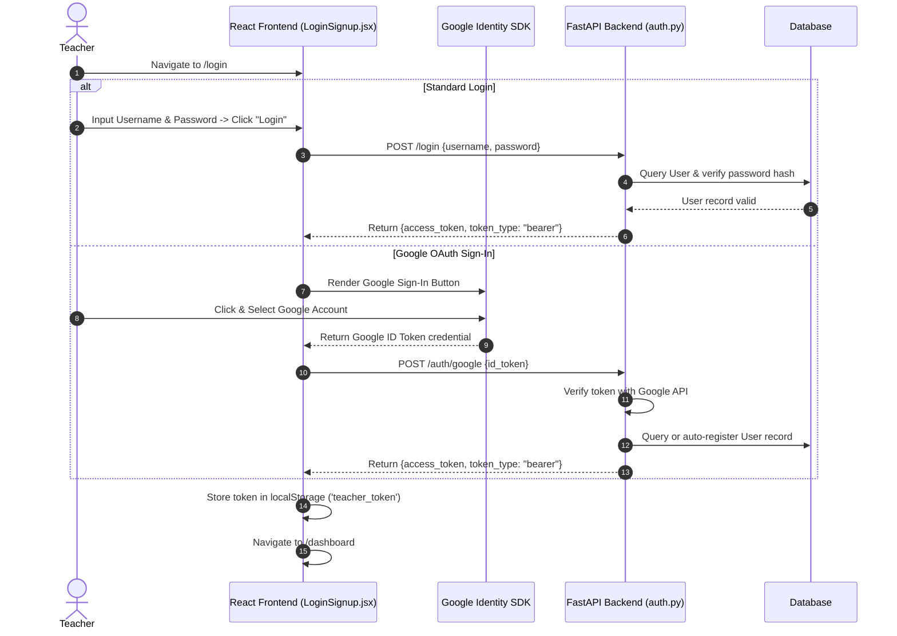
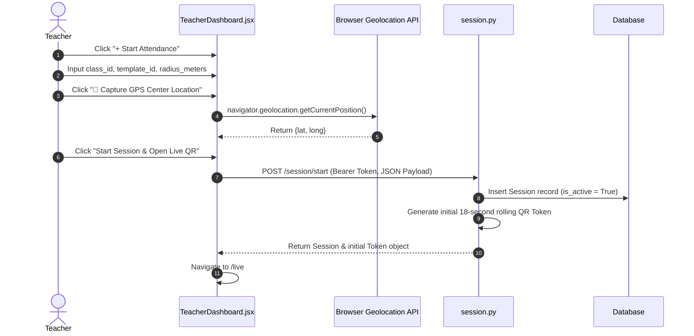
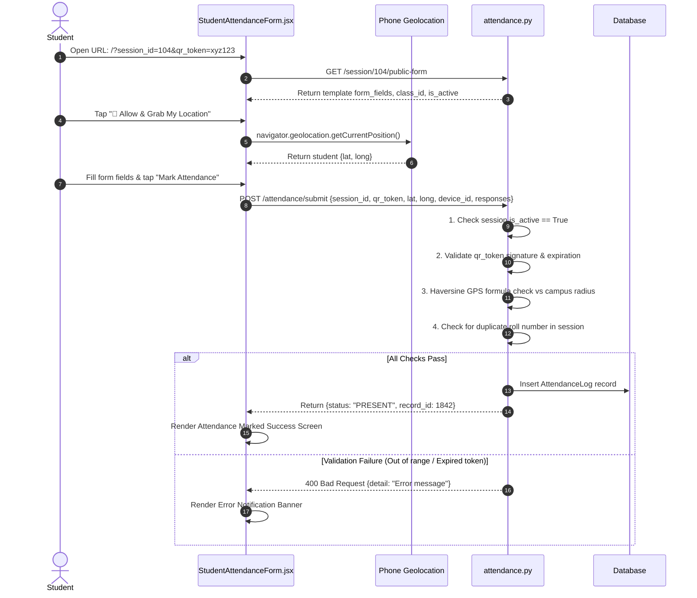
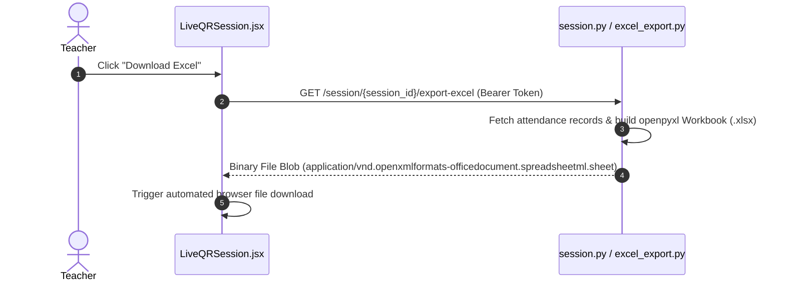

# ROLLQR
## Professional UX Flow & Wireframe Specification

---

## 01 — Product Overview

**RollQR** is an automated classroom attendance platform designed for educational institutions (specifically tailored for institutions like KCC Institute of Technology & Management — KCCITM). The application eliminates manual roll calls and paper sign-in sheets by providing a real-time classroom attendance mechanism based on **dynamic rolling QR codes**, **GPS campus geofencing**, and **customizable form templates**.

### Primary Value Proposition
- **For Teachers:** Launch a live attendance session in under 10 seconds, project a dynamic rotating QR code, monitor attendance in real time, and download structured Excel spreadsheets (`.xlsx`) immediately after class.
- **For Students:** Zero app installation required. Students scan the live classroom QR code with standard phone cameras, grant GPS location access to confirm physical presence, fill out required student details, and receive instant verification.
- **For Institutions:** Prevent proxy attendance (buddies marking absent friends) through high-frequency rolling QR token validation, GPS distance boundaries, and device hardware binding.

---

## 02 — User Roles

RollQR serves three distinct user personas with distinct operational permissions and journeys:

### 1. Teacher (Primary Operational User)
- **Goal:** Quickly capture accurate classroom attendance without wasting lecture time.
- **Key Actions:** Log in, create reusable form presets, capture GPS center location, launch live attendance sessions, monitor incoming scans, end sessions, and download `.xlsx` reports.
- **Device Context:** Desktop / Laptop / Tablet projected onto classroom screen or smartboard.

### 2. Student (End Respondent)
- **Goal:** Mark attendance quickly and accurately from a personal mobile device.
- **Key Actions:** Point phone camera at classroom screen, open URL, allow GPS browser location, fill required roll number and student details, submit, and view confirmation receipt.
- **Device Context:** Mobile smartphones (iOS & Android) via web browser.

### 3. Admin (Institutional Manager)
- **Goal:** Configure campus locations and geographic boundaries to enforce institutional security.
- **Key Actions:** Authenticate using secret admin credentials, register college email domains (`kccitm.edu.in`), set campus latitude/longitude centroids, define allowed geofence radii (meters), and view/delete registered campus boundaries.
- **Device Context:** Desktop / Admin Terminal (`admin.html`).

---

## 03 — Information Architecture

RollQR is structured into three isolated functional domains: Public/Auth Area, Faculty Command Area, and Student Response Interface.

```text
                                  ROLLQR ARCHITECTURE
                                           │
         ┌─────────────────────────────────┼─────────────────────────────────┐
         │                                 │                                 │
   PUBLIC / AUTH                    TEACHER PORTAL                    STUDENT SCANNER
         │                                 │                                 │
   ├── Landing Page                 ├── Dashboard                     └── Mobile Scan Page
   └── Authentication               │     ├── Active Session Banner             ├── GPS Capture
         ├── Login                  │     ├── Quick Action Cards            ├── Dynamic Fields
         └── Signup                 │     └── Recent History Table          └── Attendance Submit
                                    │                                             ├── Success Screen
                                    ├── Start Session Setup                       └── Failure Alert
                                    │     ├── Class Details
                                    │     ├── Form Preset Selector
                                    │     └── Geofence Radius
                                    │
                                    ├── Live QR Control Room
                                    │     ├── Dynamic QR Reticle
                                    │     ├── Refresh Countdown
                                    │     └── Roster Summary
                                    │
                                    └── Template Builder
                                          ├── Template Form Editor
                                          ├── Live Student Preview
                                          └── Saved Presets Grid
```

---

## 04 — Sitemap

```text
Landing Page ( / )
  ├── Login / Signup ( /login )
  │     └── [ Authentication Success ] ──► Teacher Dashboard ( /dashboard )
  │                                            ├── Start Attendance Modal
  │                                            │     └── [ Launch ] ──► Live QR Control Room ( /live )
  │                                            │                          └── [ End Session ] ──► Summary / Dashboard
  │                                            ├── Templates ( /templates )
  │                                            │     └── Create / Edit Template Form
  │                                            └── Session History Section
  │
  ├── Student Mobile Scan ( /scan OR /?session_id=X&qr_token=Y )
  │     ├── GPS Location Grant
  │     ├── Fill Attendance Details
  │     └── [ Submit ]
  │           ├── Success Confirmation Screen
  │           └── Failure / Error Alert Screen
  │
  └── Admin Portal ( /admin.html )
        ├── Connect / Authenticate (Secret Key)
        └── Institution Management (Campus Centroids & Geofencing)
```

---

## 05 — User Flows (UX Journey)

*Note: This section describes pure user actions and screen transitions from the perspective of the user ("What does the user do, and where does the user go next?"). For backend API, database, and technical sequence details, see Section 11.*

### 5.1 Teacher Journey Flow

```text
Landing Page
     ↓
Login / Signup
     ↓
Authentication Success
     ↓
Teacher Dashboard
     ↓
Start Attendance
     ↓
Session Setup
     ↓
Capture Location
     ↓
Select Attendance Template
     ↓
Start Session
     ↓
Live QR Control Room
     ↓
Students Scan QR
     ↓
Attendance Count / Session Monitoring
     ↓
End Attendance
     ↓
Session Summary
     ↓
Download Excel
     ↓
Return to Dashboard
```

#### Step-by-Step Screen Transitions:

1. **Landing Page (`/`)**
   - **User Action:** Clicks "Start Attendance" or "Login" in top navigation bar.
   - **Result:** System navigates user to Auth Portal.
   - **Next Screen:** Login / Signup (`/login`).

2. **Login / Signup (`/login`)**
   - **User Action:** Enters username & password and clicks "Login ->", OR clicks "Sign in with Google".
   - **Result:** Credentials validated, teacher session activated.
   - **Next Screen:** Teacher Dashboard (`/dashboard`).

3. **Teacher Dashboard (`/dashboard`)**
   - **User Action:** Clicks "+ Start Attendance" primary action button.
   - **Result:** Start Attendance Modal overlay opens on screen.
   - **Next Screen:** Session Setup Modal.

4. **Session Setup Modal**
   - **User Action:** Enters Subject/Class name (e.g., "CS301"), selects an Attendance Form Preset, inputs Geofence Radius (e.g., "30 meters"), clicks "📍 Capture GPS Center Location", then clicks "Start Session & Open Live QR".
   - **Result:** Session initialized with captured GPS center. Modal closes and switches view.
   - **Next Screen:** Live QR Control Room (`/live`).

5. **Live QR Control Room (`/live`)**
   - **User Action:** Displays screen to classroom. Monitors the dynamic rotating QR code and auto-refresh countdown timer.
   - **Result:** Students scan and submit attendance. Roster updates.
   - **Next Screen:** Live QR Control Room (Active State).

6. **Ending Session**
   - **User Action:** Clicks "End Attendance" button.
   - **Result:** End Session confirmation dialog appears.
   - **Next Screen:** Confirmation Dialog -> Clicks "End Attendance Now".

7. **Session Summary State (`/live`)**
   - **User Action:** Views total present student roster count. Clicks "Download Excel Report".
   - **Result:** System downloads `.xlsx` spreadsheet directly to teacher's computer.
   - **Next Screen:** Clicks "Back to Dashboard" -> Teacher Dashboard (`/dashboard`).

---

### 5.2 Student Journey Flow

```text
Classroom QR
     ↓
Scan QR
     ↓
Attendance Page
     ↓
Session Validation
     ↓
Allow Location
     ↓
GPS Verification
     ↓
Attendance Form
     ↓
Enter Details
     ↓
Submit Attendance
     ↓
Validation
   ↙       ↘
Success    Failure
   ↓         ↓
Success    Error
Screen     Screen
```

#### Step-by-Step Screen Transitions & Failure Scenarios:

1. **Scanning QR**
   - **User Action:** Student points phone camera at classroom projection screen and taps the pop-up URL link.
   - **Result:** Phone web browser opens the attendance link.
   - **Next Screen:** Student Attendance Form (`/scan?session_id=X&qr_token=Y`).

2. **Granting Location Access**
   - **User Action:** Student taps "📍 Allow & Grab My Location" button.
   - **Result:** Phone requests browser location permission; GPS coordinates captured.
   - **Next Screen:** Button turns green showing "GPS Verified".

3. **Filling & Submitting Form**
   - **User Action:** Fills out Roll Number, Full Name, and any custom template fields (e.g., Section), then taps "Mark Attendance".
   - **Result:** Submission evaluated against session rules.

#### Failure Scenarios (Supported Logic):

- **Scenario A — QR Token Expired:**
  - *User Experience:* Student submits with an old QR token after timer rotation.
  - *Screen Action:* Show Red Banner: `"Invalid or expired QR token. Please scan current QR on screen."`
  - *Next Action:* Student scans the updated QR code currently on the projection screen.

- **Scenario B — Student Outside Geofence Boundary:**
  - *User Experience:* Student attempts to submit from outside classroom/campus radius.
  - *Screen Action:* Show Red Banner: `"Location verification failed: You are outside allowed classroom radius."`
  - *Next Action:* Student moves physically inside classroom and taps "Retry GPS".

- **Scenario C — Duplicate Roll Number Submission:**
  - *User Experience:* Student attempts to submit a Roll Number that has already been recorded for this session.
  - *Screen Action:* Show Red Banner: `"Attendance already submitted for Roll Number X."`
  - *Next Action:* Form entry blocked to prevent proxy submission.

- **Scenario D — Inactive / Ended Session:**
  - *User Experience:* Student scans link after teacher has clicked "End Attendance".
  - *Screen Action:* Display Disabled Form View: `"This attendance session has ended. Submissions are closed."`

---

### 5.3 Admin Journey Flow

```text
Admin Portal ( admin.html )
     ↓
Connect / Authenticate
     ↓
Institution Management
     ↓
View Registered Institutions
     ├── Add New Institution
     ├── Update Campus Location & Geofence
     └── Delete Institution Boundary
```

#### Step-by-Step Screen Transitions:

1. **Admin Portal Access (`/admin.html`)**
   - **User Action:** Admin opens `/admin.html`, enters Backend URL and Admin Secret Key, clicks "Connect to Backend".
   - **Result:** Secret verified; Institution Management cards become visible.
   - **Next Screen:** Institution Command Center.

2. **Managing Campus Centroids**
   - **User Action:** Inputs Email Domain (e.g., `kccitm.edu.in`), Campus Name, Latitude, Longitude, and Radius (meters), then clicks "Save Institution".
   - **Result:** Institution centroid saved to system table.
   - **Next Screen:** Refreshed Registered Institutions table.

---

## 06 — Navigation Architecture

```text
                               PRIMARY NAVIGATION MODEL
                                          │
                  ┌───────────────────────┴───────────────────────┐
                  │                                               │
           FACULTY ROUTING                                 STUDENT ROUTING
                  │                                               │
    ┌─────────────┼─────────────┐                         ┌───────┴───────┐
    │             │             │                         │               │
Dashboard     Sessions      Templates                 Scan Link       Success Page
( /dashboard ) ( /live )   ( /templates )            ( /scan )       ( Confirmation )
    │             │             │                         │               │
  [CTA]         [CTA]         [CTA]                     [CTA]           [CTA]
Start Session  End Session  Save Preset               Submit Form     Close Browser
```

### Route Protection & Redirection Behavior:
- **Protected Routes (`/dashboard`, `/live`, `/templates`):** Require active teacher login token. Unauthenticated users visiting these routes are immediately redirected to `/login`.
- **Auth Guard (`/login`):** If an authenticated teacher visits `/login`, they are automatically redirected forward to `/dashboard`.
- **Public Routes (`/`, `/scan`):** Accessible to anyone without login.

---

## 07 — Screen Inventory

| Screen # | Screen Name | Route / Component | Primary User | Purpose | Entry Point | Exit / Next Point |
| :--- | :--- | :--- | :--- | :--- | :--- | :--- |
| **1** | Landing Page | `/` (`HomePage.jsx`) | Public | Product overview, features & entry CTAs | Browser URL | Login / Signup or Scan |
| **2** | Login / Signup | `/login` (`LoginSignup.jsx`) | Unauthenticated | Teacher login & Google SSO | Navbar "Login" | Teacher Dashboard |
| **3** | Teacher Dashboard | `/dashboard` (`TeacherDashboard.jsx`)| Teacher | Control hub, active session & history | Login Success | Modal, Live QR, Templates |
| **4** | Start Attendance Modal | Overlay (`TeacherDashboard.jsx`) | Teacher | Class setup, preset & GPS capture | "+ Start Attendance" | Live QR Control Room |
| **5** | Live QR Control Room | `/live` (`LiveQRSession.jsx`) | Teacher | Dynamic QR projection & timer | Start Session | End Session Modal |
| **6** | End Session Modal | Overlay (`LiveQRSession.jsx`) | Teacher | Confirm session closing | "End Attendance" | Session Summary View |
| **7** | Session Summary View | `/live` (`LiveQRSession.jsx`) | Teacher | Final count & Excel download | Session Ended | Teacher Dashboard |
| **8** | Template Builder | `/templates` (`TemplateBuilder.jsx`)| Teacher | Form builder & live preview | Nav "Templates" | Saved Presets Grid / Dashboard |
| **9** | Student Attendance Form| `/scan` (`StudentAttendanceForm.jsx`)| Student | GPS grab & detail submission | QR Camera Scan | Success or Error Screen |
| **10** | Student Success Screen | View (`StudentAttendanceForm.jsx`) | Student | Confirms attendance recording | Form Submission | Close Browser |
| **11** | Student Error Screen | View (`StudentAttendanceForm.jsx`) | Student | Explains rejection reason | Failed Submission | Retry Location / Re-scan |
| **12** | Institution Admin Portal| `/admin.html` (`admin.html`) | Admin | Campus centroid & domain setup | Direct Admin URL| Saved Institutions Table |

---

## 08 — Wireframes (Low-to-Mid Fidelity Layout Specifications)

*Note: Wireframes focus strictly on **layout, structural hierarchy, and interaction points**. Styling details like exact color hexes, gradients, and drop shadows are excluded to prioritize UX clarity.*

### Screen 1: Landing Page (`/`)
```text
+-----------------------------------------------------------------------------------+
| [RQ] RollQR    Home   How it Works v   Features v   For Teachers   [ Login ] [ Start ]|
+-----------------------------------------------------------------------------------+
|                                                                                   |
|  Eliminate Classroom Proxy Attendance.       +---------------------------------+  |
|  Instant Dynamic QR Roll Call.               | LIVE SESSION: KCCITM            |  |
|                                              | CSE 3rd Year        [42 Present]|  |
|  Take attendance in 10 seconds with dynamic  | +-----------------------------+ |  |
|  rotating QR codes & GPS verification.       | | [   DYNAMIC QR RETICLE    ] | |  |
|                                              | | [   REFRESHES CONTINUOUSLY] | |  |
|  [ Start Attendance -> ] [ Learn More ]      | +-----------------------------+ |  |
|                                              | Session Progress: 42/62         |  |
|  (v) GPS Verified  (v) Zero App Download     +---------------------------------+  |
|                                                                                   |
+-----------------------------------------------------------------------------------+
|  BUILT FOR CLASSROOMS AT: [ KCCITM ]  ·  KCC Institute of Technology & Management |
+-----------------------------------------------------------------------------------+
```

---

### Screen 2: Login / Signup (`/login`)
```text
+------------------------------------------+----------------------------------------+
| [RQ] RollQR                              | Teacher Login                          |
|                                          | Enter your credentials to continue.    |
| Welcome back.                            |                                        |
| Your attendance dashboard is a scan away.| [ G  Sign in with Google             ] |
|                                          | ----------------- OR ----------------- |
| +--------------------------------------+ |                                        |
| | LIVE SESSION PREVIEW                 | | USERNAME *                             |
| | KCCITM · CSE 3rd Year   [42 Present] | | [ prof_sharma                      ] |
| | [ Mini Dynamic QR ]                  | |                                        |
| +--------------------------------------+ | PASSWORD *                             |
|                                          | [ **********                   (o) ] |
| * Generate QR in 1 click                 |                                        |
| * GPS-verified attendance                | [ Login ->                           ] |
| * Instant Excel download                 |                                        |
|                                          | Don't have an account? [Create account]|
+------------------------------------------+----------------------------------------+
```

---

### Screen 3: Teacher Dashboard (`/dashboard`)
```text
+-----------------------------------------------------------------------------------+
| [RQ] RollQR    Dashboard   Sessions   Templates                 [ Prof. Sharma (S)]|
+-----------------------------------------------------------------------------------+
|                                                                                   |
|  FACULTY OPERATIONAL COMMAND                                                      |
|  Good morning, Prof. Sharma 👋                                                    |
|  Manage classroom attendance in seconds.            [ + Start Attendance ]         |
|                                                                                   |
|  ACTIVE ATTENDANCE SESSION                                                        |
|  +------------------------------------------------------------------------------+  |
|  | (• LIVE ATTENDANCE)  Session #104                                            |  |
|  | CS301 Data Structures & Algorithms                                           |  |
|  | Geofence Radius: 30m  •  Preset: CSE Standard Roster                          |  |
|  |                                      [ End Attendance ]  [ Open Live QR -> ] |  |
|  +------------------------------------------------------------------------------+  |
|                                                                                   |
|  QUICK ACTIONS                                                                    |
|  +-----------------------+  +-----------------------+  +-----------------------+  |
|  | (Play)                |  | (Plus)                |  | (History)             |  |
|  | Start Attendance      |  | Create Template       |  | View History          |  |
|  +-----------------------+  +-----------------------+  +-----------------------+  |
|                                                                                   |
|  RECENT ATTENDANCE ACTIVITY                                   [ Filter sessions ] |
|  +------------------------------------------------------------------------------+  |
|  | CS301 Data Structures  •  Session #104  [LIVE]        [ Download Excel ]     |  |
|  | CS302 Database Systems •  Session #101  [ENDED]       [ Download Excel ]     |  |
|  +------------------------------------------------------------------------------+  |
+-----------------------------------------------------------------------------------+
```

---

### Screen 4: Start Attendance Modal
```text
+-------------------------------------------------------------------------+
| (QR) Start Attendance                                              [X]  |
| Set up your class and generate a QR code.                               |
+-------------------------------------------------------------------------+
|                                                                         |
| CLASS / SUBJECT NAME *                                                  |
| [ CS301 Data Structures & Algorithms                                  ] |
|                                                                         |
| ATTENDANCE FORM PRESET                                                  |
| [ Standard Default Form (Roll Number, Student Name)                 v ] |
|                                                                         |
| GEOFENCE BOUNDARY RADIUS (METERS)                                       |
| [ 30 ]  Allowed student radius from instructor GPS center               |
|                                                                         |
| [ (📍) GPS Verified (28.6139, 77.2090)                                ] |
|                                                                         |
+-------------------------------------------------------------------------+
|                                  [ Cancel ]  [ Start Session & Open Live QR ]
+-------------------------------------------------------------------------+
```

---

### Screen 5: Live QR Control Room (`/live`)
```text
+-----------------------------------------------------------------------------------+
| [RQ] RollQR   (• LIVE ATTENDANCE CONTROL)            [ Download Excel ] [ Dashboard ]|
+-----------------------------------------------------------------------------------+
|                                                                                   |
|                    (• ATTENDANCE LIVE)                                            |
|                    CS301 Data Structures & Algorithms                             |
|                    Students can scan the QR code below using their phone.          |
|                                                                                   |
|                 +---------------------------------------+                         |
|                 |  +---------------------------------+  |                         |
|                 |  |                                 |  |                         |
|                 |  |      [ DYNAMIC QR CODE ]        |  |                         |
|                 |  |    (Refreshes automatically)    |  |                         |
|                 |  |                                 |  |                         |
|                 |  +---------------------------------+  |                         |
|                 |  Scan to mark attendance              |                         |
|                 |  (~) QR refreshes in 18s              |                         |
|                 +---------------------------------------+                         |
|                                                                                   |
|  +----------------------+  +----------------------+  +-------------------------+  |
|  | 1. SCAN              |  | 2. VERIFY            |  | 3. RECORDED             |  |
|  | Student scans QR     |  | GPS & Token checked  |  | Added to roster         |  |
|  +----------------------+  +----------------------+  +-------------------------+  |
|                                                                                   |
|                 [ End Attendance ]    [ Download Excel ]                          |
+-----------------------------------------------------------------------------------+
```

---

### Screen 6: End Session Confirmation Modal & Summary View
```text
MODAL CONFIRMATION:
+-------------------------------------------------------------------------+
| (!) End Attendance Session?                                             |
| Students will no longer be able to scan or submit.                      |
| Class: CS301 Data Structures & Algorithms                               |
+-------------------------------------------------------------------------+
|                                          [ Cancel ]  [ End Attendance Now ]
+-------------------------------------------------------------------------+

COMPLETED SUMMARY VIEW:
+-----------------------------------------------------------------------------------+
|                         +-------------------------------+                         |
|                         |              [✓]              |                         |
|                         |     Attendance Completed      |                         |
|                         | Session ended. Tokens locked. |                         |
|                         |                               |                         |
|                         | ROSTER TOTAL                  |                         |
|                         | 48 Students Present           |                         |
|                         |                               |                         |
|                         | [ Download Excel Report ]     |                         |
|                         | [ Back to Dashboard ]         |                         |
|                         +-------------------------------+                         |
+-----------------------------------------------------------------------------------+
```

---

### Screen 7: Template Builder (`/templates`)
```text
+-----------------------------------------------------------------------------------+
| [RQ] RollQR    Dashboard   Sessions   Templates           [ <-- Back to Dashboard ]|
+-----------------------------------------------------------------------------------+
| Attendance Templates                                      [ + Create Template ]   |
| Create reusable forms for your classes.                                           |
+-----------------------------------------------------------------------------------+
| CREATE TEMPLATE                                                                   |
| +-----------------------------------------------+ +-----------------------------+ |
| | TEMPLATE NAME *                               | | (• LIVE STUDENT PREVIEW)    | |
| | [ CS301 Daily Attendance                    ] | |                             | |
| |                                               | | +-------------------------+ | |
| | ATTENDANCE FIELDS               [ + Add Field ] | | | Mark Attendance         | | |
| | +-------------------------------------------+ | | | CS301 Daily Attendance  | | |
| | | Field #1                                  | | | |                           | | |
| | | [ Roll Number    ] [ Text               v ] | | | Roll Number *             | | |
| | | [x] Required  [x] Unique Roll Number      | | | | [ Enter Roll Number     ] | | |
| | +-------------------------------------------+ | | |                           | | |
| | | Field #2                      [ Remove ]  | | | Student Name *            | | |
| | | [ Student Name   ] [ Text               v ] | | | [ Enter Student Name    ] | | |
| | | [x] Required  [ ] Unique Roll Number      | | | |                           | | |
| | +-------------------------------------------+ | | | [ Mark Attendance ]     | | |
| |                                               | | +-------------------------+ | |
| | [ Cancel ]           [ Save Template ]        | | Interactive Mobile Preview  | |
| +-----------------------------------------------+ +-----------------------------+ |
+-----------------------------------------------------------------------------------+
```

---

### Screen 8: Student Attendance Form (`/scan`) — Mobile Optimized
```text
+-----------------------------+
| [RQ] RollQR  [Student Scan] |
+-----------------------------+
| Mark Attendance             |
| CS301 Data Structures       |
| Enter your details.         |
+-----------------------------+
|                             |
| [📍 Allow & Grab My Location]|
|  GPS Verified (28.61, 77.20)|
|                             |
| STUDENT NAME *              |
| [ Aarav Sharma            ] |
|                             |
| ROLL NUMBER *               |
| [ 2024001                 ] |
|                             |
| SECTION                     |
| [ Section A               v ]
|                             |
| [ (✓) Mark Attendance     ] |
|                             |
+-----------------------------+
```

---

### Screen 9: Student Success & Error Screens — Mobile View

```text
SUCCESS CONFIRMATION:           FAILURE / ERROR ALERT:
+-----------------------------+ +-----------------------------+
|                             | | [RQ] RollQR  [Student Scan] |
|            [ ✓ ]            | +-----------------------------+
|     Attendance Marked!      | | (!) ERROR SUBMITTING        |
|  Recorded successfully.     | | You are outside the allowed |
|                             | | classroom GPS boundary.     |
|  CONFIRMATION DETAILS       | |                             |
|  Status: PRESENT            | | [ Retry GPS Location ]      |
|  Record ID: #1842           | |                             |
|                             | | Powered by RollQR           |
| Powered by RollQR           | +-----------------------------+
+-----------------------------+
```

---

### Screen 10: Institution Admin Portal (`/admin.html`)
```text
+-----------------------------------------------------------------------------------+
| [RQ] RollQR                                                  [ Admin Portal ]     |
+-----------------------------------------------------------------------------------+
| Institution Management                                                            |
| Set college campus location & geofence boundary for secure attendance             |
|                                                                                   |
| +-------------------------------------------------------------------------------+ |
| | (Key) Admin API Credentials                                                   | |
| | Backend URL: [ https://your-backend.onrender.com                            ] | |
| | Secret Key:  [ ********************                                         ] | |
| | [ Link Connect to Backend ]                                                   | |
| +-------------------------------------------------------------------------------+ |
|                                                                                   |
| +-------------------------------------------------------------------------------+ |
| | (Location) Add / Update Institution                                           | |
| | Email Domain: [ kccitm.edu.in ]   College Name: [ KCC Institute of Tech     ] | |
| | Latitude:     [ 28.465000     ]   Longitude:    [ 77.502000                 ] | |
| | Radius (m):   [ 200           ]                                               | |
| | [ My Location ] [ Save Institution ]                                          | |
| +-------------------------------------------------------------------------------+ |
|                                                                                   |
| +-------------------------------------------------------------------------------+ |
| | (Apartment) Registered Institutions                            [ Refresh ]    | |
| | DOMAIN         COLLEGE NAME       CAMPUS LAT, LONG       RADIUS     ACTION    | |
| | kccitm.edu.in  KCCITM Campus      28.46500, 77.50200     200m       [Delete]  | |
| +-------------------------------------------------------------------------------+ |
+-----------------------------------------------------------------------------------+
```

---

## 09 — Responsive Behavior

### Desktop Layout Strategy (Teachers & Administrators)
- **Multi-Column Dashboard:** Left hero operational banner, right quick actions, wide recent history data table.
- **Side-by-Side Builder:** Template Builder presents the Form Editor on the left 7 columns and the Live Interactive Student Form Preview on the right 5 columns.
- **Large QR Display:** Live QR Control Room renders a 230px+ QR SVG suitable for classroom projection screens.

### Mobile Layout Strategy (Students)
- **Single Column Stack:** All fields, banners, and buttons stack vertically with `max-w-md` centering.
- **Touch Targets:** Large minimum button heights (48px+) for "Allow & Grab My Location" and "Mark Attendance".
- **Distraction-Free:** Unnecessary header links and footers removed to keep student scan focused on 3 taps: Scan -> GPS -> Submit.

---

## 10 — Interaction States

Every primary interactive screen supports six core states:

1. **Default State:** Normal operational view ready for user interaction.
2. **Loading State:** Displayed during API fetches or GPS retrieval (e.g., `"Fetching Location..."` spinner on button).
3. **Active State:** Session currently running (`LIVE` pulse indicator on Dashboard & Live QR page).
4. **Success State:** Feedback modal or banner shown upon successful submission/save (`"Attendance Marked!"` receipt).
5. **Error State:** Warning notification when validation fails (`"Location outside allowed radius"` red banner).
6. **Disabled State:** Action button unclickable until prerequisites met (e.g., "Start Session" button disabled until GPS location is captured).

---

## 11 — Technical / System Flows (Architecture Layer)

*Note: This section contains technical sequence diagrams detailing backend API endpoints, database interactions, JWT tokens, and background logic. Keep these separate from the non-technical User Flows in Section 05.*

### 11.1 Authentication & Google OAuth Sequence



---

### 11.2 Start Session & Dynamic QR Generation Sequence



---

### 11.3 Student Attendance Verification & Submission Sequence



---

### 11.4 Excel Export Sequence



---

## 12 — Existing vs Recommended Features

To ensure complete clarity for engineering and product teams, features are strictly classified below:

### EXISTING (Currently Implemented in Codebase)
- **Teacher Authentication:** Username/password signup and login, Google Identity Services OAuth 2.0 integration, JWT token issuance.
- **Dynamic Rolling QR Code:** Backend token generation refreshing every 18–20 seconds to prevent QR screenshot sharing.
- **GPS Campus Geofencing:** Haversine formula calculation enforcing distance boundaries between student GPS and teacher/campus center.
- **Template Form Builder:** Custom attendance presets with text, number, dropdown, and unique roll number fields.
- **Excel Roster Export:** Automated `.xlsx` file download for ended sessions via `openpyxl`.
- **Institution Administration:** `/admin.html` portal for setting college domain centroids and geofence radii.

### RECOMMENDED (Future Sprints / UX Enhancements)
- **Real-Time Live Counter via WebSockets / SSE:** Push student scan updates live to the projection screen without polling.
- **Progressive Web App (PWA) Offline Support:** Offline caching of student forms for poor connectivity classrooms.
- **Haptic Vibration & Audio Feedback:** Mobile vibration on successful scan confirmation.
- **Multi-Teacher Departmental Template Sharing:** Shared presets across faculty members under the same college domain.

---

## 13 — UX Recommendations

1. **Visibility of QR Timer:** Display an animated radial progress ring around the countdown seconds on `/live` so teachers and students visually anticipate token rotation.
2. **Clear GPS Guidance:** If student location capture fails or accuracy is poor (>50m), provide a step-by-step tooltip advising students to enable high-accuracy location mode or step near windows.
3. **One-Tap Re-Scan:** On QR expiration errors, include a single "Scan Next QR" button that opens the device camera directly within the web application.

---

## 14 — Developer Handoff Notes

- **Authentication Headers:** All endpoints except `/session/{id}/public-form` and `/attendance/submit` require the `Authorization: Bearer <jwt_token>` header.
- **Schema Validation:** In `backend/app/routes/session.py`, ensure all database ORM session models are mapped to `SessionResponse` Pydantic schemas to avoid serialization errors.
- **Device Fingerprinting:** `getDeviceId()` in `App.jsx` stores a persistent unique device ID in `localStorage.getItem('student_device_id')` to assist in anti-proxy verification.
- **Admin Secret Header:** Admin requests from `admin.html` require `X-Admin-Secret` header matching the server's `ADMIN_SECRET` environment variable.
